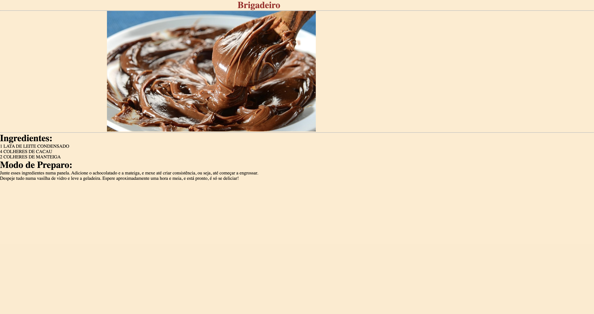

# RECEITA DE BRIGADEIRO

## Sobre
Este projeto foi feito com o intuito de realizar a inicialização dos projetos com linguagens de marcação como HTML, CSS e Markdown, realizados no curso técnico de desenvolvimento de sistemas [SENAI JANDIRA](https://sp.senai.br/unidade/jandira/).

## Tecnoligias Utilizadas
- HTML;
- CSS;
- Markdown.

## Autor

- [Gabriel Silva Guedes](https://www.linkedin.com/in/gabriel-guedes-84b507327/)